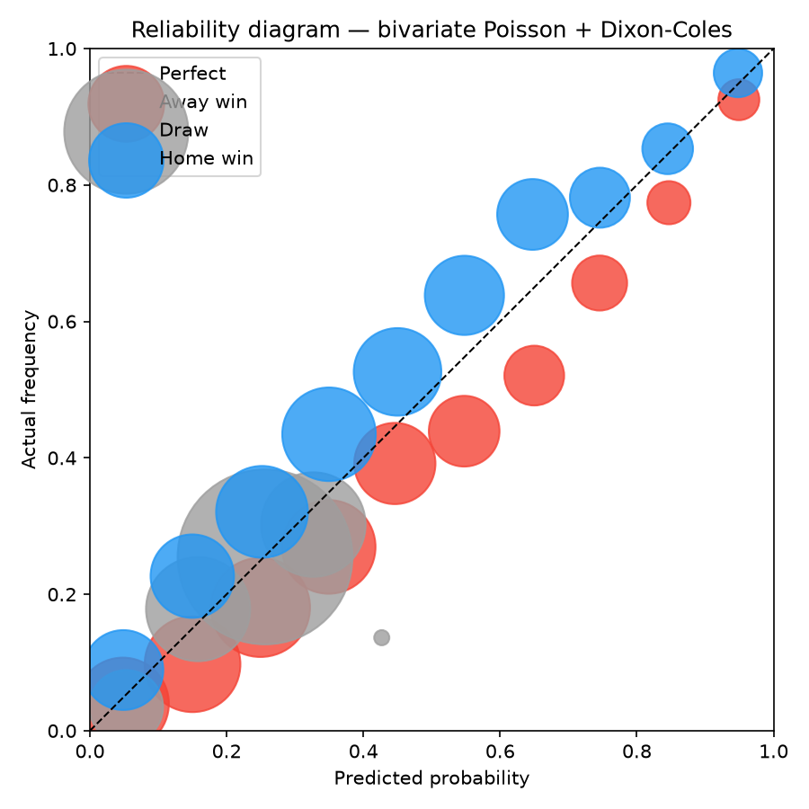
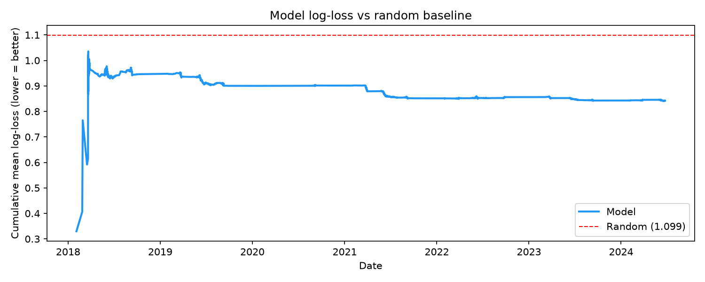

<div align="center">

# WC 2026 Forecaster

**Probabilistic match predictions for FIFA World Cup 2026. Locked before kickoff, never touched after.**

[](https://github.com/VirajMishra1/worldcup-forecaster/actions/workflows/daily-fetch.yml) [](https://www.python.org/)

[Live Dashboard](https://virajmishra1.github.io/worldcup-forecaster/) · [Track Record](#live-track-record)

</div>

---

## What is this?

Most football predictions are gut-feel dressed up as analysis. This is a proper statistical model: a Dixon-Coles score model fit on 13,779 international matches from 2010 to 2024, with time-decay weighting, squad-value adjustments from Transfermarkt, and calibration tuned on a 5,500-match held-out backtest.

Before every World Cup game, it produces a full probability distribution over every possible scoreline (0-0, 1-0, 2-1, and so on). From that distribution it derives win/draw/loss odds, over/under 2.5 goals, BTTS, and the three most likely exact scores. All of that gets committed to GitHub 60 minutes before kickoff and is never edited. After the match, actual outcomes are compared and the track record updates automatically.

The goal is not to beat bookmakers. It is to build something genuinely calibrated and prove it on live data, with a verifiable record anyone can check in the git history.

---

<!-- WINNER_ODDS_START -->
## WC 2026 Winner Odds

10,000 Monte Carlo bracket simulations, updated after every result.

Implied odds = 1/p − 1. At 20% win probability, fair implied odds are 4.0:1 (a £10 bet at fair value returns £50 total).

| Team | Win % | Implied odds |
|------|-------|--------------|
| 🇦🇷 Argentina | 18.6% | 4.4:1 |
| 🇪🇸 Spain | 14.9% | 5.7:1 |
| 🇨🇴 Colombia | 11.4% | 7.7:1 |
| 🏴󠁧󠁢󠁥󠁮󠁧󠁿 England | 11.2% | 8.0:1 |
| 🇧🇷 Brazil | 9.4% | 9.7:1 |
| 🇧🇪 Belgium | 5.6% | 16.9:1 |
| 🇫🇷 France | 5.0% | 18.8:1 |
| 🇳🇱 Netherlands | 4.5% | 21.3:1 |
| 🇩🇪 Germany | 4.4% | 21.8:1 |
| 🇵🇹 Portugal | 3.8% | 25.7:1 |
| 🇨🇦 Canada | 1.7% | 58.2:1 |
| 🇺🇸 United States | 1.6% | 60.7:1 |

_76 completed WC 2026 results included. Updated 2026-06-30._

<!-- WINNER_ODDS_END -->

---

<!-- TRACK_RECORD_START -->
## Live Track Record (12 matches)

| Metric | Value | Random baseline |
|--------|-------|-----------------|
| W/D/L accuracy | 58.3% | 33.3% |
| Log-loss | 0.9141 | 1.0986 |
| Brier score | 0.5599 | 0.6667 |

_4 predictions generated after kickoff (Portugal vs DR Congo, England vs Croatia, Ghana vs Panama, Uzbekistan vs Colombia) are excluded from this table. Visible with an [r] badge on the [live dashboard](https://virajmishra1.github.io/worldcup-forecaster/)._

_Per-match breakdown on the [live dashboard](https://virajmishra1.github.io/worldcup-forecaster/)._

<!-- TRACK_RECORD_END -->

---


## How predictions are scored

### Log-loss

Log-loss is the standard metric for probabilistic forecasters. For each match, the score is:

```
LL = -[ y_H * ln(p_H) + y_D * ln(p_D) + y_A * ln(p_A) ]
```

Where `y_H`, `y_D`, `y_A` are 1 if that outcome happened (0 otherwise), and `p_H`, `p_D`, `p_A` are the predicted probabilities. You take the log of the predicted probability for the thing that actually happened, then negate it.

A few examples to make this concrete:

| Prediction | Outcome | Log-loss |
|-----------|---------|----------|
| 90% home win | Home wins | 0.105 (good) |
| 60% home win | Home wins | 0.511 (ok) |
| 60% home win | Away wins | 0.916 (bad) |
| 90% home win | Away wins | 2.303 (terrible) |

Being confidently wrong is heavily penalized. This is the point: log-loss rewards calibration. A model that says "60% home" when home teams win 60% of the time will score better long-term than one that says "90% home" when home teams win 60% of the time, even if the overconfident model has higher raw accuracy.

Random guessing (33% each) scores 1.0986. The model targets below 1.0. The backtest sits at 0.8961. The live track record is at 0.8687.

### Brier score

Brier score is the mean squared error between predicted probabilities and outcomes:

```
Brier = (p_H - y_H)^2 + (p_D - y_D)^2 + (p_A - y_A)^2
```

Averaged across all matches. Lower is better. Random guessing gives 0.667. Perfect predictions give 0. The model backtest sits at 0.5265.

Brier is more forgiving of confident mistakes than log-loss (squared vs logarithmic penalty), so the two metrics together give a fuller picture.

---

## How the model works

### Why Poisson and Dixon-Coles

Goals in football are rare, roughly independent events in a fixed 90-minute window. That is exactly the setup where Poisson is the right distribution. Match data across thousands of games confirms this: the marginal distribution of goals per team per match fits Poisson closely.

The alternative approaches all have meaningful problems for this use case:

**ELO**: gives a single win probability but no scoreline distribution. You cannot derive over/under 2.5 or exact scores from an ELO rating, which cuts off a large part of what a forecaster should be able to do.

**Neural network / gradient boosting**: 13,779 matches is a tiny dataset for a deep learning model. Dixon-Coles has roughly 3N + 2 parameters (N = number of teams), which is around 930 parameters for this dataset. A neural network would need many thousands and would overfit badly on data this sparse. Tree-based models also produce black-box outputs with no interpretable team ratings.

**Simple regression on recent form**: ignores the full historical record of how teams perform against each other and produces poorly calibrated probability estimates.

Dixon-Coles (1997) is the established approach in the football modelling literature specifically because it handles low-scoring outcomes well. Standard independent Poisson models systematically underestimate how often 0-0, 1-0, 0-1, and 1-1 games happen. Dixon-Coles adds a correction term (tau) that inflates those four scorelines to match what the data shows.

<details>
<summary><strong>Model equations</strong></summary>

Each team `i` has an attack parameter `alpha_i` and defense parameter `delta_i`. For a match between home team `i` and away team `j`:

```
lambda_home = exp(alpha_i + delta_j + gamma * is_home)
lambda_away = exp(alpha_j + delta_i)

P(X=x, Y=y) = tau(x, y, rho) * Poisson(x; lambda_home) * Poisson(y; lambda_away)
```

The tau correction applies only when `x + y <= 1`. The fitted rho is approximately -0.065. All 309 team parameters plus rho and the home-advantage coefficient gamma are found jointly by maximum likelihood (L-BFGS-B optimizer).

`is_home = 0` for all WC matches since every game is at a neutral venue.

</details>

### Training data

13,779 international matches from 2010 to 2024:

- **Time decay:** exponential weighting with a 1.5-year half-life. A match from 2020 counts roughly 3x more than the same match from 2017.
- **Friendly downweight:** friendlies carry 15% of the weight of competitive fixtures.
- **WC tournament boosts:** WC 2022 weighted 3x, 2018 at 2x, 2014 at 1.5x, 2010 at 1.2x. Same competition format means stronger signal.
- **xG substitution:** for 63 WC 2022 matches, actual scorelines are replaced with StatsBomb expected goals. xG removes the luck from finishing and gives a cleaner read on which team actually dominated.

The model is refitted daily as WC 2026 results come in, which are added at 3x weight.

### Adjustments at prediction time

**Squad values:** Transfermarkt market values are used to correct for teams with thin historical records. Haiti at 18 million euros vs France at 1.2 billion should not require hundreds of historical matches to get right. Applied conservatively (exponent 0.375, capped at 50% effect).

**Recent form:** last 5 competitive matches, weighted by opponent quality. A win against Argentina counts more than a win against a bottom-ranked team. Capped at plus or minus 15% on expected goals.

**Rest days:** small adjustment of plus or minus 3% per day relative to a 4-day baseline.

**Calibration:** temperature scaling fitted on a held-out 20% slice of the backtest (1,104 matches). The fitted temperature of 1.12 means the model is slightly overconfident in its raw outputs, and this step corrects for that. Unlike fitting three independent regressors, temperature scaling preserves the constraint that win/draw/loss probabilities sum to 1.

### How predictions stay honest

Everything in `data/predictions.parquet` is append-only. A GitHub Action locks predictions 60 minutes before kickoff and commits them to the repo. There is no mechanism to overwrite a locked row. After the match, results are fetched and the track record updates. The git history is the full audit trail.

---

## Model performance

Walk-forward backtest, refitted every 30 days, no lookahead, 5,518 matches (2018-2023):

| Metric | Model | Random baseline |
|--------|-------|-----------------|
| Log-loss | 0.8961 | 1.0986 |
| Brier score | 0.5265 | 0.6667 |
| W/D/L accuracy | 59.0% | 33.3% |



The calibration plot shows whether predicted probabilities match actual frequencies. When the model says 60%, do the predicted teams win 60% of the time? A perfectly calibrated model lies on the diagonal.



---

## Run locally

```bash
git clone https://github.com/VirajMishra1/worldcup-forecaster.git
cd worldcup-forecaster
python3.11 -m venv .venv && source .venv/bin/activate
pip install -e ".[dev]"
```

Get a free API key from [football-data.org](https://www.football-data.org/) and add it to `.env`:

```
FOOTBALL_DATA_API_KEY=your_key_here
```

Then:

```bash
python -m scripts.fetch_fixtures        # fetch WC 2026 schedule
python -m scripts.fetch_results         # fetch completed results
python -m scripts.refit_params          # fit the model
python -m scripts.predict_all_fixtures  # generate and lock predictions
python -m scripts.simulate_tournament   # 10k tournament simulation
python -m cli.predict --home France --away Argentina  # single match
python -m cli.backtest --start 2018-01-01 --end 2024-12-31  # historical backtest
```

---

## Stack

- Python 3.11, numpy, scipy, pandas, pyarrow
- scikit-learn for temperature scaling calibration
- httpx for data fetching
- GitHub Actions for the full daily pipeline
- GitHub Pages for the dashboard

---

## References

- Dixon, M. and Coles, S. (1997). Modelling Association Football Scores and Inefficiencies in the Football Betting Market. *Applied Statistics*, 46(2), 265-280.
- Karlis, D. and Ntzoufras, I. (2003). Analysis of sports data by using bivariate Poisson models. *The Statistician*, 52(3), 381-393.
- StatsBomb open data (WC 2022 expected goals): [github.com/statsbomb/open-data](https://github.com/statsbomb/open-data)
